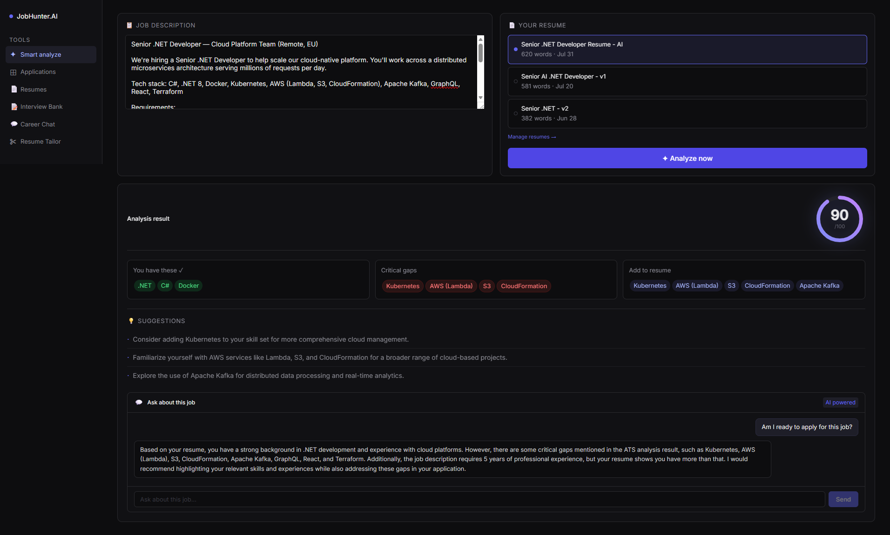
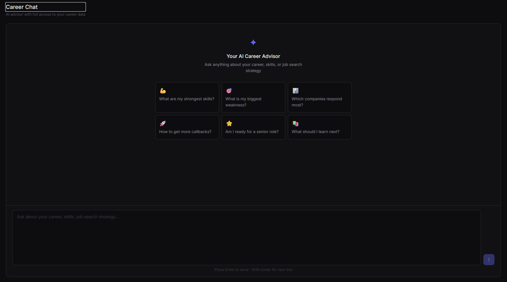
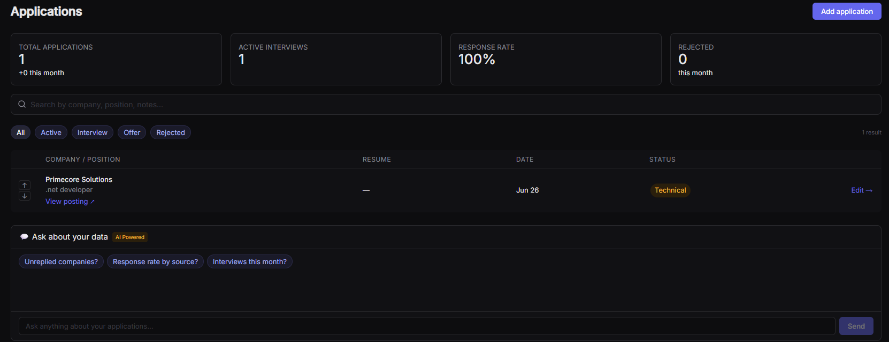
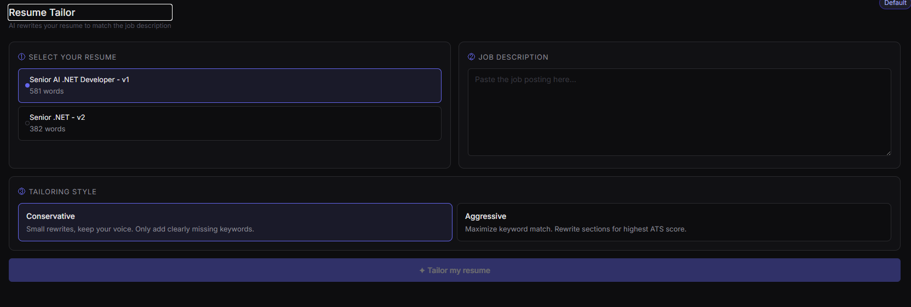

# 🎯 JobHunter.AI

**A hybrid, local-first AI career assistant — resume analysis, interview prep, and application tracking with zero hallucinations.**


[](https://dotnet.microsoft.com/)
[](https://dotnet.microsoft.com/apps/aspnet/web-apps/blazor)
[](https://www.postgresql.org/)
[](https://ollama.com/)
[](./LICENSE)
[](https://deepwiki.com/hadihamedian/JobHunter.AI)

---

## 🧭 Overview

JobHunter.AI is an end-to-end career management platform built to solve a very practical problem: **generic AI resume tools hallucinate, and generic ATS tools are dumb**. This project takes a hybrid approach — deterministic, rule-based logic where accuracy matters (skill matching, scoring) combined with a **local LLM (via Ollama)** for the parts that genuinely benefit from generative reasoning (chat, tailoring, interview question generation).

Everything runs **locally by default** — no data ever has to leave your machine, no API keys, no per-token cost. It's both a daily-use tool for managing a job search and a demonstration of applied .NET + AI architecture: Minimal APIs, Blazor WebAssembly, PostgreSQL, and a pragmatic RAG/prompting layer on top of Ollama.

> Originally shipped as **JobAssistant**, renamed and re-architected as **JobHunter.AI**.

---

📸 Screenshots
| Smart Analyze | Career Chat |
| :---: | :---: |
|  |  |

| Applications Dashboard | Resume Tailor |
| :---: | :---: |
|  |  |

---

## ✨ Key Features

| Module | What it does |
|---|---|
| 🧠 **Smart Analyze** | Deterministic resume-to-job-description matching — real skill-gap detection, not vague AI guessing |
| 💬 **Career Chat** | Conversational assistant for career advice, grounded in your own resume/profile data |
| 📊 **Applications Dashboard** | Track every application: status, dates, notes, outcomes, in one place |
| 📄 **Resume Manager** | Store, organize, and version multiple resumes |
| 🎯 **Resume Tailor** | Generates a job-specific tailored resume, exported as a clean Markdown → PDF |
| 🗣️ **Interview Prep** | AI-generated, role-specific interview questions and talking points |
| 🏦 **Interview Bank** | A growing, searchable bank of past interview questions and answers |

---

## 🏗️ Architecture

JobHunter.AI is a two-project solution: a Minimal API backend and a Blazor WebAssembly frontend, backed by PostgreSQL for persistence and Ollama for local inference.

```
┌─────────────────────────┐        ┌──────────────────────────────┐
│   JobHunter.AI.Web       │  HTTP  │      JobHunter.AI.Api         │
│   (Blazor WebAssembly)   │◄──────►│      (ASP.NET Core Minimal)  │
│                          │        │                               │
│  Pages:                  │        │  Services:                   │
│   • Applications          │        │   • AiAnalyzerService         │
│   • CareerChat             │        │   • CareerAdvisorService      │
│   • Resumes                │        │   • CareerChatService         │
│   • ResumeTailor            │        │   • DataChatService           │
│   • InterviewBank           │        │   • InterviewGeneratorService │
└─────────────────────────┘        │   • ResumeTailorService       │
                                    │   • ResumeRecommendationService│
                                    │   • Repositories (Postgres)   │
                                    └───────────────┬───────────────┘
                                                    │
                                        ┌───────────▼────────────┐
                                        │   Ollama (local LLM)     │
                                        │   qwen2.5-coder:7b       │
                                        └─────────────────────────┘
                                                    │
                                        ┌───────────▼────────────┐
                                        │      PostgreSQL          │
                                        └─────────────────────────┘
```

**Design principle:** deterministic logic (skill matching, scoring, structured data) stays in plain C# services — the LLM is only invoked where natural-language generation or reasoning is genuinely required (chat, tailoring, question generation). This keeps the "Smart Analyze" results explainable and reproducible instead of a black box.

---

## 🛠️ Tech Stack

- **Backend:** ASP.NET Core Minimal API (.NET 10)
- **Frontend:** Blazor WebAssembly
- **Database:** PostgreSQL (via Npgsql)
- **AI/LLM:** [Ollama](https://ollama.com/) running `qwen2.5-coder:7b` locally
- **Export:** Markdown-based PDF generation for tailored resumes

---

## 🚀 Getting Started

### Prerequisites

- [.NET 10 SDK](https://dotnet.microsoft.com/download)
- [PostgreSQL](https://www.postgresql.org/download/) (running locally or accessible via connection string)
- [Ollama](https://ollama.com/download) installed, with the model pulled:
  ```bash
  ollama pull qwen2.5-coder:7b
  ```

### Configuration

Update `JobHunter.AI.Api/appsettings.json` with your local settings:

```json
{
  "Ollama": {
    "Url": "http://localhost:11434/api/generate",
    "Model": "qwen2.5-coder:7b"
  },
  "ConnectionStrings": {
    "DefaultConnection": "Host=localhost;Database=jobhunter;Username=postgres;Password=postgres"
  }
}
```

### Run it

```bash
# Clone the repo
git clone https://github.com/hadihamedian/JobHunter.AI.git
cd JobHunter.AI

# Start the API
cd JobHunter.AI.Api
dotnet run

# In a separate terminal, start the Blazor client
cd JobHunter.AI.Web
dotnet run
```

The API will be available at the port shown in the console (see `Properties/launchSettings.json`), and the Blazor app will proxy requests to it.

---

## 📂 Project Structure

```
JobHunter.AI/
├── JobHunter.AI.Api/            # Backend - Minimal API
│   ├── Models/                  # Request/response DTOs
│   ├── Services/                # Business logic + Ollama integration
│   └── Program.cs
│
├── JobHunter.AI.Web/            # Frontend - Blazor WASM
│   ├── Pages/                   # Applications, CareerChat, Resumes, ResumeTailor, InterviewBank
│   ├── Layout/
│   ├── Models/
│   ├── Services/                # HTTP clients to the API
│   └── Program.cs
│
└── JobHunter.AI.slnx
```

---

## 🗺️ Roadmap

- [ ] Authentication / multi-user support
- [ ] Configurable LLM backend (swap Ollama models or providers)
- [ ] Richer analytics on the Applications Dashboard
- [ ] Dockerized setup (API + Web + Postgres in one `docker-compose up`)

---

## 📜 License

Licensed under the [MIT License](./LICENSE).

---

## 👤 Author

**Hadi Hamedian** — Senior .NET Developer & Technical Lead
Building AI-integrated .NET systems, remote-first.

[GitHub](https://github.com/hadihamedian) · Open to remote contract work (GMT+3:30)
